Project ni boshlashdan oldin bizda texnik topshiriqlar to'plami va frontend uchun qilingan design bo'ladi. 

structure database uchun postgres yoki mysql

ko'p boshlang'ich dasturchilar yo'l qo'yadigan xatolardan biri `database design` bilan ishlamaslik.` database design(UML diagramms)` bizga hali code yozmasdan oldin ma'lumotni shaklini ko'rishga imkon beradi va database bilan bog'liq xatolarni oldindan ko'ramiz. code yozilgan keyin va ma'lumot bilan to'lgan database da bitta `column` qo'shish xam bazida juda ko'p o'zgarishlarga olib keladi. database design ni oldindan tuzib olish shu muammolarni bartaraf qiladi. 

project online elektron do'kon. shu uchun ko'proq logikalar product atrofida aylanadi.
database schema product table bilan boshlanadi.

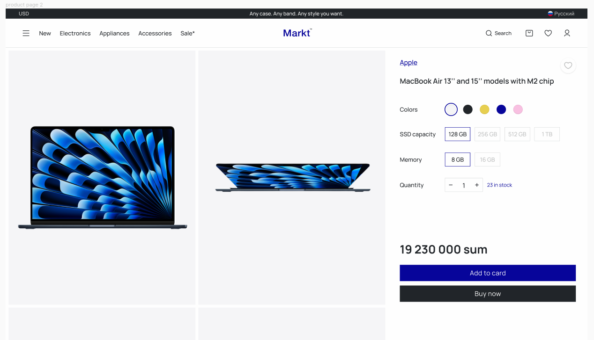


`product` da ko'rishimiz mumkinki (`title`, `brand`, `color`, `memory`, `quantity`, `price`, `images`), pastgi qismda parameters bor, `media file` lar bilan alohida ishlaymiz shu uchun `images` ga chalg'imaymiz. Oddiy holda product table shu ko'rinishda bo'ladi.

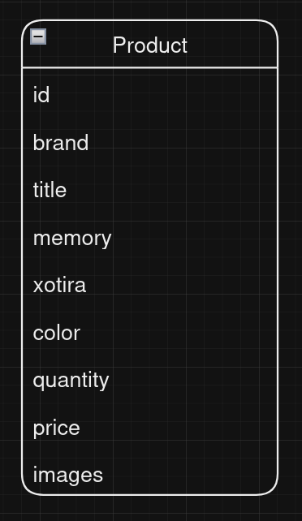


bir xil `brand` ga tegishli product lar bo'ladi shu uchun brand uchun alohida table yaratishimiz kerak va product bilan `one to many` ko'rinishida bog'lanadi.

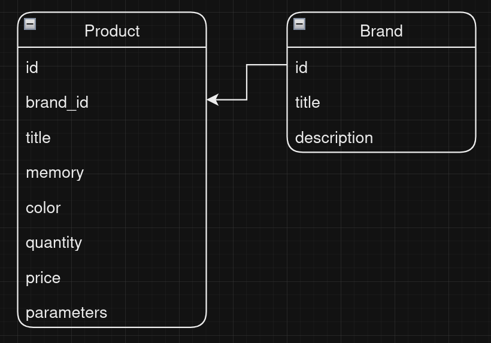


parameters column xilma xil bo'lishi mumkin lekin product uchun o'zgarmas bo'ladi masalan material, og'irlik shunga o'xshash. parameter table yaratamiz va `one to many` relation bilan bog'lanadi. `misol uchun: (title: material, value: titan)`

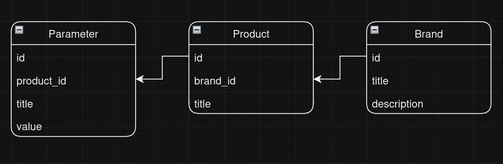


elektron product larni `color`, `memory` dan tashqari boshqa o'zgarib turuvchi variantlari bo'lishi mumkin `display`, `prosessor` shunga o'xshash. bu muammoni hal qilish uchun SQL database uchun `EAV pattern(entity, attribute, value)`  mavjud o'zgarishi mumkin bo'lgan parameter ajratib olamiz, `many to many` relation bilan bog'lanadi. bu biz hohlagan malumotni saqlay oladi. misol: (product.title:"iphone XR", (attribute:"memory", (value:"64GB", value:"128GB")), (attibute:"color", (value:"black", value:"green"))). 

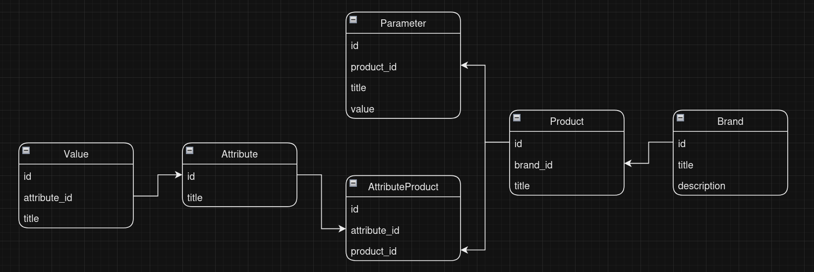


product price va quantity uchun `stock` table dan foydalanamiz. `stock.attributes` json object saqlaydi.
```[
  {"attribute_id":4,"value_id":19},
	{"attribute_id":4,"value_id":16},
	{"attribute_id":3,"value_id":105}
]```
shu attribute larga ega bo'lgan product ni narxi va omborda mavjud soni. `one to many` saqlanadi

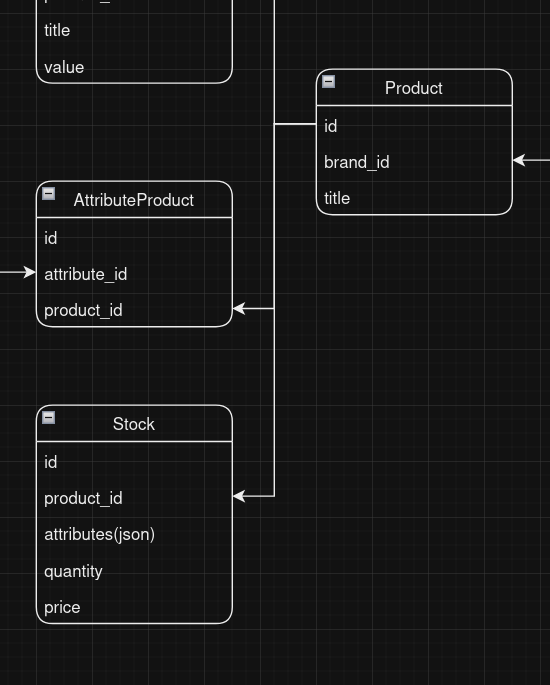


product data deyarli tayyor holga keldi qolgan ishlar `category` va `tag` table lar. category table ni vazifasi bizni tayyor product qaysi product turi ekanligini bildiradi. elektron qurilmalar, aksisuarlar va boshqalar. subcategorylar bo'lishi mumkin, elektron qurilmalarni ichida smartfon va noutbuklar bo'lishi mumkin eng oddiy yo'li category table ni o'zida `category_id` column va `one to many` saqlash.

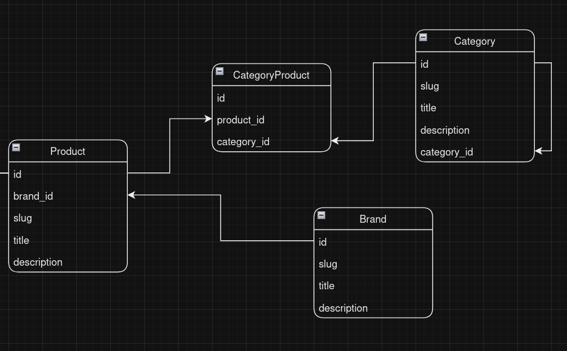


`tag` table ni vazifasi chegirmalarni saqlash (top product, 30% aksiya). bu category ga o'xshash bo'ladi.

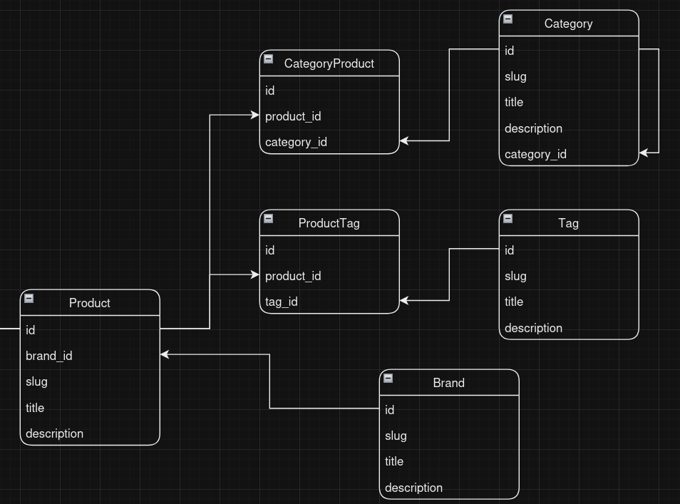


product data tayyor. keyingi ish `user` bilan qilinadi. `product` ni `cart` ga qo'shish uchun , bizda `user` va `cart` table kerak. cart ga esa aynan tanlangan product ni qo'shishimiz kerak, demak product emas stock cart ga qo'shiladi. quantity ni ham cart table ma'lum vaqt saqlab turadi.

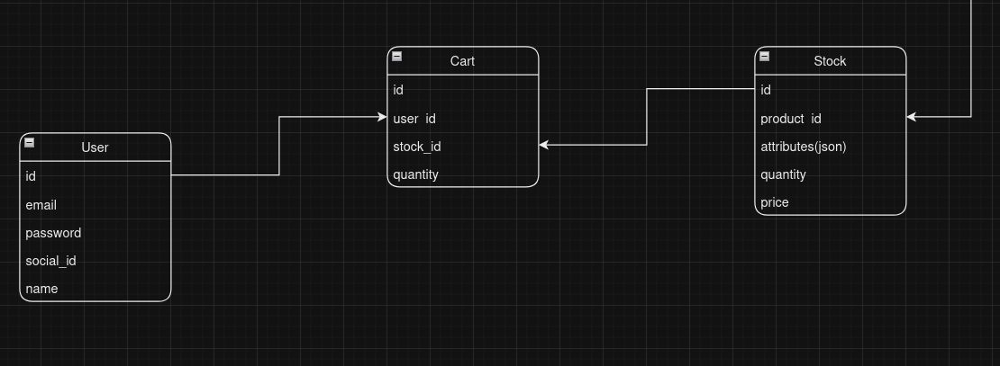


user product ni sotib olmoqchi `cart` ga qo'shdi va `order` yaratishi kerak. Bitta `order` table bilan ko'proq product larni yaratishda muammo bo'lishi mumkin, shu uchun `orderItem` table yaratamiz va unda har bir `product.stock` ni `order` dan oldin saqlaymiz va bitta yoki bir nechta `orderItem` lar bitta order ni tashkil qiladi va order user ga `one to many` ko'rinishda saqlanadi. order da `status` column bo'ladi to'lov qilingan yoki yo'q, yetkazildi yoki yo'qligini bildiradi.

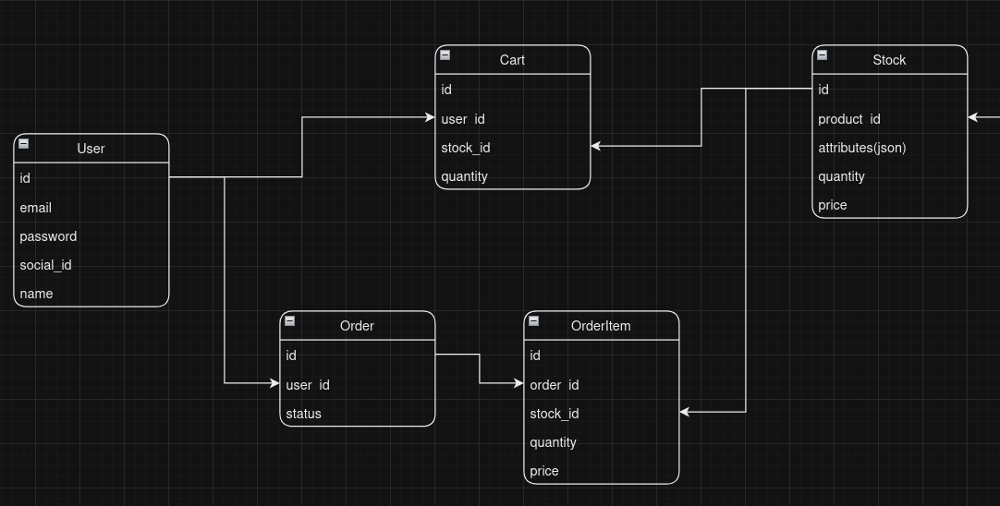


`product.images`, `brand.images`, `catergory.images` bular hammasi media file ularni `media` table da saqlaymiz va `polymorphic` relation bilan bog'lanadi.

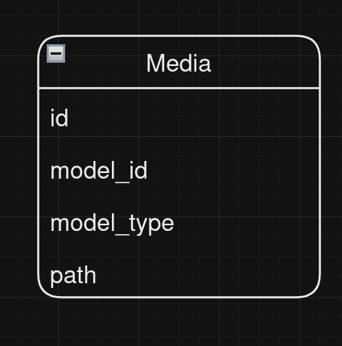


`database schema` elektron do'konimiz uchun tayyor holga keladi.

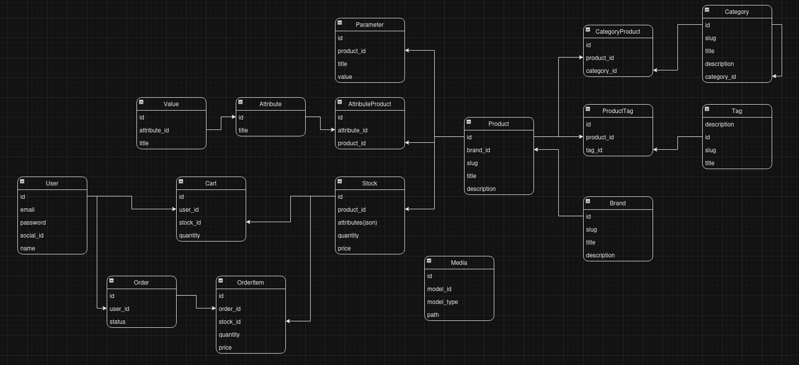