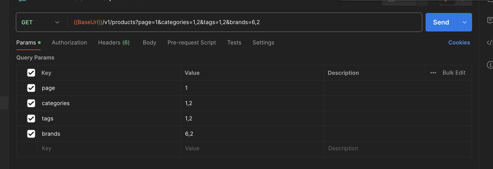
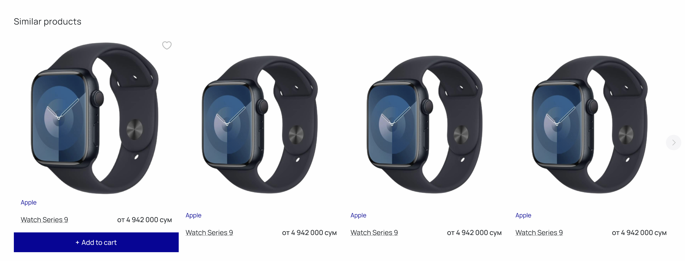

headerdagi logikani keginroqqa olib qoysak ham boladi

keying navbatda category page. routinga `/category/{id}` pageni qoshamiz. `id` bizga productalrni categoriyaga qarab filtr qilishga kerak bo'ladi.

kegin dizaynini boshlaymiz
birinchi yaratib olgan layoutimiz bilan pageni oraymiz. kegin cardlar listini qurib olamiz va backenddan productlarini olish uchun postmanga qaraymiz. 

ahamiyat bersangiz bizning productlar oladigan apiyimizda `page`, `categories`, `tags`, `brands` degan paramterlar bor. bu parametrlar orqali biz o'layotgan productlarimizni categoriya, brand va teglarga filtrlab olishimiz mumkin. `page` parametr esa biz olayotgan ma'lumotlarimizni bo'laklarga ajratib kerakli qisimni faqat zaruriyat payti olishga yordam beradi.

bu page uchun yoki `global state manager` ishlatasiz yoki  `state` ni componentlarni eng tepasida ushlaysiz. bu page da productlar ro’yxatidan boshqa narsa ko'p emas shuning uchun qaysi yol performanc uchun yaxshi o'ylab otirmasakham boladi, ozingizga qulayini tanlang. har query parametr ozgarishida, oz pagegingizni `url`ni o'zgartitishni unutmang, bu orqali siz boshqa stranitsadan qaytganda shu url qurylarni olib eski pageni eski holatini qaytarib olasiz va sgu ssilkani share qilsangiz boshqa odamlardaham sizdaka filtrlar turgan boladi

category productlardan kegin o'xshash productlar seksiyasi ko'rsangiz bo'ladi.

Axamiyat bergan bolsangiz bunday seksiya productning pagedaham bor. shuning uchun uni aloxida lazy component qilib olsak boladi. uning vazifasi faqatgina  user pasga scroll qilganda o'xshash productlarni olib ko'rsatish bo'ladi