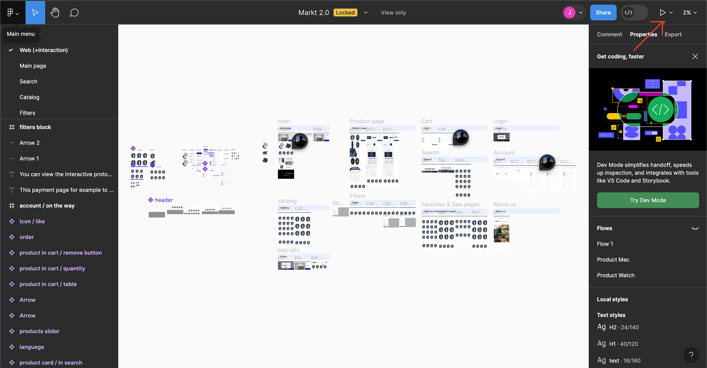

kod yozishni boshlashdan oldin birinchi navbatda figma dizayni ochib butun proekt qanday tuzilgan va unda nimalar bolishi kerakligini bir sitra ko’rib chiqishni maslaxat beraman. bunday qilish uchun figma dizaynga kirganingizda ong-chap burchakda play ikonkani bosasiz va live previewni ochasiz.

