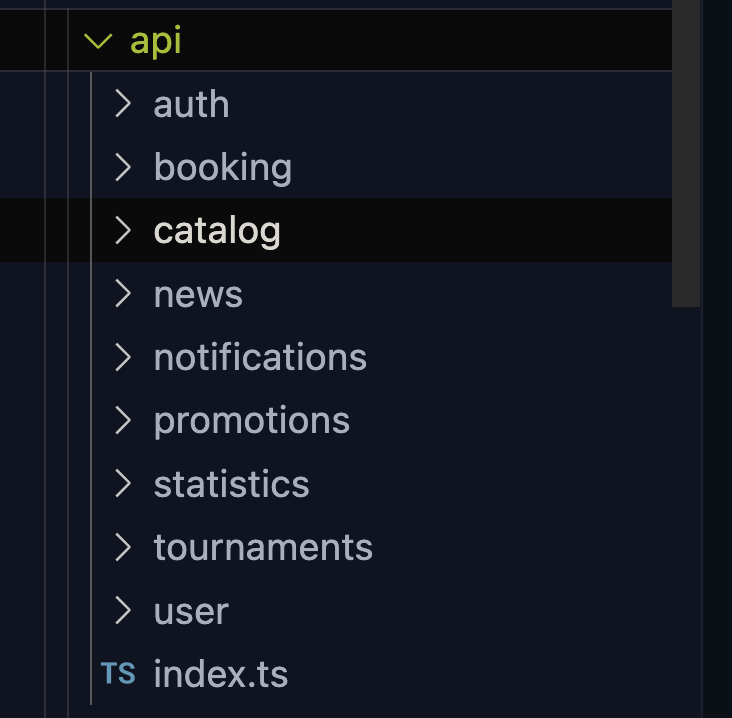

routingni qura boshlaymiz. boshidan har bir routni qoymasdan, ish jarayoni sari qoshib boramiz. 
birinchi main page ya’ni  `/` dan boshlaymiz va uni vyorstkaisga otamiz

korishingiz boyicha bizning har bir ekranimiza bir hil header va footer ishlatilgan. bundan kelib chiqib biz har bir ekran uchun bitta layout(ekranlarimizni orab turadigan qobiq) component yaratib olsak boladi. bu yol bilan biz kodni ajratlishi va qayta takrorlavermasligiga erishamiz. kelajakda barcha ko’p takrorlanadigan elementlarga shu yolni qollashni maslaxat beraman.
 
korishingiz boyicha bizda media kontent kam emas shuning uchun saytimiz performance ni boshidan oylab `lazy loading` uchun packagela otqazamiz 

https://developer.mozilla.org/en-US/docs/Web/Performance/Lazy_loading

https://web.dev/articles/lazy-loading-images

react: https://www.npmjs.com/package/react-lazy-load-image-component

vue: https://github.com/hilongjw/vue-lazyload

angular: https://angular.io/guide/image-directive

home pageni UI qismi tayyor bo'lgandan kegin. birinchi backend bilan muloqotni o'rnatishga harakat qilsak bo'ladi

## postman documentation

https://documenter.getpostman.com/view/14560296/2sA2xb5ExG

bu linkni bosib uni ichidagi documentatsiyani o'z postmaningizga local yuklab olsangiz bo'ladi.
faqat u to'liq ishlashi uchun siz postmanda https://api.markt.circle.uz/api
ni BaseUrl degan variablega qo'yishingiz kerak.
buning uchun siz postman

## backend bilan muloqot qilish uchun birinchi tayyorgarlikni boshlaymiz.

bizning web ilovamizdan backendga request yuborish uchun bizga uning baseUrl kerak boladi.

baseUrlini va boshqa sizning saytingiz uchun kerak bolgan ma'lumotlarni envoirement variablarda saqlash yaxshi hisoblanadi.

https://create-react-app.dev/docs/adding-custom-environment-variables/

https://cli.vuejs.org/guide/mode-and-env.html#environment-variables

https://angular.io/guide/build#configuring-application-environments 

api degan papka ochib u yerga backend bilan muloqot qilish uchun kerakli funksiyalarni yozib qoya boshlasak boladi. 
menda odatda api folder shunday tuzulishda boladi:

index.ts fileda men faqatgina request qila oladigan funksiya yoki object yaratib olaman va qolgan papkalarni vazifa boyicha bolib chiqman. `catalog` bilan ishlaydigan requestlarni `catalog` papkaga, `product` bilan ishlaydigan requestlarni `product` papkaga. uning vazifasi berilgan parametrlar, metodlar va  siz bergan pathni .env fayldagin baseUrl bilan bog’lash orqali
backendga request yuborish va statuslarni yoki kelgan data orqali error yoki togri response qaytarsh.
bunday funksiya bizga qobiq bolib hizmat qiladi. agar tushunmagan bolsangiz hozir osonroq tushuntirib beraman

tassavvur qiling siz bu yo’l bilan yozmay, har bir  API requestni component yoki boshqa joy ichida `fetch` orqali yozib chiqdingiz,
kelajakda sizga: avtorizatsiya uchun  local storagedan token olib qoyish kerak deyishdi. 
bu holatda siz harbir yozgan funksiyangizni ozgartirib chiqasiz.  (mayli nima qilibdi deyishingiz mumkin :p)

undan kegin teamlidingiz kelib: fetch eski bolib qoldi, fetchni yangiroq axiosga ozgartiraylik desa. yana ozgartirasiz. bu ketishda, muntazam kodni ozgartirishingiz sababli yoki UI qism bilan kodinigiz aralashib ketishi: kod xunuk yoki tushunarsiz holatga olib keladi. 

bizning holatda tashqariga olib chiqilgan index fileda birgina funkisya ozgarishi butun `codebase` ni ishlashiga tasir qiladi, fetchni orniga axios qoysangizham, errorlani tekshiruvini ozgartirsangizham. sizni index filingiz bir ish qiladi u backendga request yuboradi undan ortiq emas, agar kodni togri yozsangiz u oz qolgan joylarham togri ishlaydi.

backend requestlarni sinash uchun promotovarlarni olib korishga harakat qilsak boladi.
categoriyalarni olgosangiz keyin yangi tovarlar seksiyasi uchun reqest qilsangiz boladi. performance uchun yana bir maslaxat, korishingiz boyicha categoriyalar va yengi tovarlar seksiyasi bisning saytga kirishimiz bilan  birinchi koradigan seksiyalarimiz emas. shuning uchun biz bu seksiyalarni lazy load qilsak boladi ya’ni ularni faqatgina client shu seksiyalarga qarab scroll qilganda render qilamiz va backendga request yuboramiz

Intersections observer link:
https://developer.mozilla.org/en-US/docs/Web/API/Intersection_Observer_API

libs for framework:

https://www.npmjs.com/package/react-intersection-observer

https://vueuse.org/core/useIntersectionObserver/

https://giancarlobuomprisco.com/angular/intersection-observer-with-angular