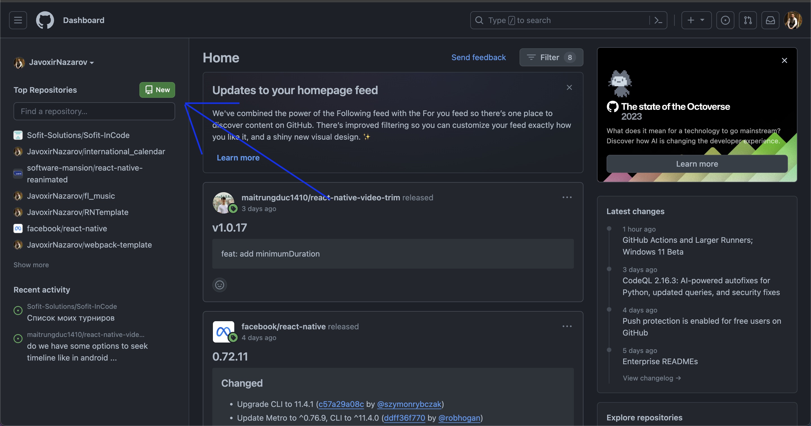
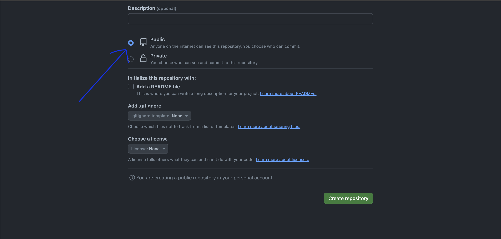
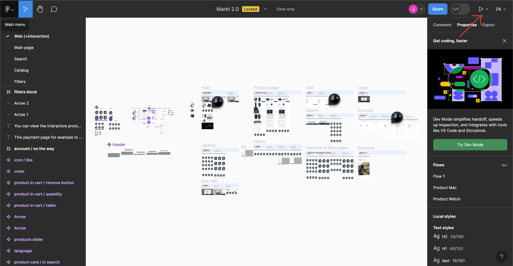

## Proekt bilan ishlashda qanday bilimlar (texnologiyalar) kerak bo'ladi:

- bu proektni tez va oson boshlashingiz uchun siz js frameworklardan  (react, vue, angular) birini bilishingiz kerak boladi
- backend bilan muloqot qilish uchun fetch apini bilishingiz
- avtorizatsiya va jwt token haqida habardor bolishingiz
- o’z framwerkingizda global state management qanday qilinishi haqida boshlang’ich ma’lumot
- routing haqida tushuncha va o’z framwerkingizda routing qura olish
- figma bilan ishlashni bilish
- postman bilan ishlay olish (requestlarni korib tekshirish uchun)
- albatta programmist uchun eng muhimi, google yoki boshqa internet resurslar orqali mustaqil tarzda ma'lumotlarni qidirshga hohishingiz

## Proekt init

birinchi navbatda o'z frameworkingiz uchun proektingizni init qilib olganizdan so'ng, ko'dingiz uchun [githubda](https://github.com/) repository ochishingizni maslaxat beraman. 

https://www.nobledesktop.com/learn/git/what-is-git

githubda repositroy sizga o'z codingizdagi o'zgarishlar tarixini ko'rishga va sizda proektingiz bilan bog'liq muommolar bolganida ko'dingizni yuklab ko'rib tez va effektiv yordam berishimizga kerak bo'ladi.

githubda proektingiz uchun yangi repository ochish uchun o'z accauntingiz bilan kirganingizda chap sidebarda yashil "New" deb yozilgan tugma bo'ladi 



shu tugmani bosib o'z repositoriyingizni yaratasishni boshlaysiz.
"Create repositroy" tugmasini bosishdan oldin repositroyni public qilib belgilashni unutmang



aks holda proektingiz boshqa odamlar uchun berk boladi ba faqatgina siz ruhsat bergan odamlar proektni ko'ra oladi. Kelajakda hususiy yoki ish joyingiz uchun proektlarda repositoryni private qilish havfsizlikni yo'li hisoblanadi.

githubda proektni yaratganingizdan so'ng oz kompyuterizdagi local kodni github bilan ulab oz'garishlarni osha repositoryga yuklay oladigan qilib to'girlaymiz.
buning uchun o'z code redactoringizga o'tib terminalni ochamiz va shu comandalarni yozamiz.

```
git init
git add .
git commit -m "birinchi commit"
git remote add origin https://${sizning repositoriyingizga bo'lgan ssilkangiz}.git
git push -u origin main
```

batafsil qilib aytganda 
`git init` butun proektingiz uchun gitni ishga tushurib uni sozlayabdi.
`git add .` sizning barcha faylardagi o'zgarishlarni saqlab qo'yyabdi. 
`git commit -m "birinchi commit"` saqlagan o'zgarishlaringizga nom berib ularni bir commitda yig'yapdi.
`git remote add origin` siz ko'rsatayotgan repositoryni o'zgarishlarni yuklaydigon joy deb belgilayabdi. Ssilkani githubda repoitoryga kirganingizda tepada, shu repositoryga olib kiradigan adress Url yozilgan joydan ko'chirib olishingiz mumkin
`git push -u origin main` barcha commitlarni githubdagi repositordagi "main" branchaga saqlayabdi.


## Figma

kod yozishni boshlashdan oldin birinchi navbatda figma dizayni ochib butun proekt qanday tuzilgan va unda nimalar bolishi kerakligini bir sitra ko’rib chiqishni maslaxat beraman. bunday qilish uchun figma dizaynga kirganingizda ong-chap burchakda play ikonkani bosasiz va live previewni ochasiz.



live previewda siz butun saytni brauzerda interactiv korishinishda ko’ra olasiz. Uyerdagi knopkalarni bosib ekranlarni korinish ketma ketligi va qaysi holatda nima korsatishi kerakligini bilib olasiz. bu yol bilan siz kod yozishdan avval sahifalar ketma-ketligiyu, holatlarini organib chigiq, so’ng reja tuzib olsangiz, keyin kutilmagan holatlarda uni ozgartirib otirmaslikka va tog’ri arxitektura tanlashga yordam beradi.


