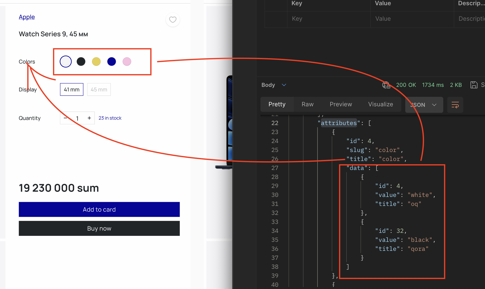
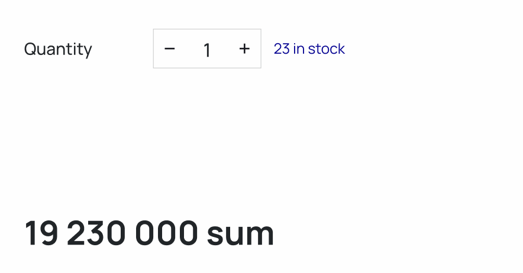
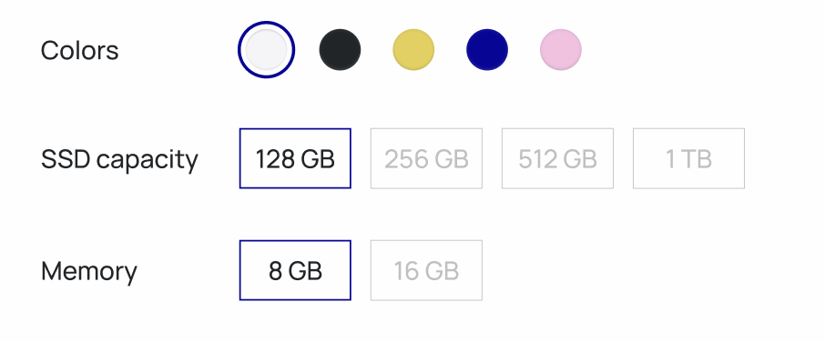

bu pageda asosan biz productni konfiguratsiyasini yigamiz. productni configuratsiyasini tanlab olish uchun ozgina algoritm yozishimizga togri keladi.
postmanda ko'rishingiz bo'yicha biz productni olish uchun bizga uning `slug` i kerak bo'ladi. siz product pageni qurish uchun routingizni `product/{slug}` korinishda qilib qurishingiz kerak buy yerda `slug` sizning ko'rmoqchi bo'lgan productingizni slugi bo'lib xizmat qiladi. pagega o'tish vaqti siz routing o'rqali shu `slug`ni olib backendan produktni olasiz.

`/products/{slug}` bilan product `obejct` ini olganingizda uning ichida  `attributes` nomli `array` bo'ladi. Bu `array` da shu productga tegishli barcha configuratsiyalarni olishingiz mumkin.

ko'rishingiz bo'yicha configuratsiyalari ko'rsatish uchun siz birinchi bo'lib `attributes` ni olasiz va uni map qilasiz, kegin `attributes` ichidagi `data` ni map qilasiz

sezgan bo'sangiz rang uchun blocklar boshqa blocklarga qaraganda sal boshqa ko'rinishda. Dizayn bo'yicha ko'rishingiz mumkinki faqatgina rang bloklari boshqa `style` da yasalgan. Bu holatda biz shu `attribute` lar orasidan `color` degan slugli atrrbutni kutib, agar attributlar to'g'ri kelsa dumaloq rangli ko'rinishdagi blokni boshqa holatda odduy bloklarni yaratamiz.

har bir attribut uchun ko'rishlarni yaratib olganingizdan kegin birinchi `default` ya'ni bizning configuratisyalarimiz orasida eng minimal va do'konda bor configuratsiyani tanlab uni soni va narixini chiqazishimiz kerak bo'ladi.

bu qisimni qilish uchun sizga product obyektidagi `stocks` degan `array` kerak bo'ladi. Bu `array` o'z ichida bizni do'kondagi bor barcha configuratsiyalarni narxi va sonini saqlaydi. Misol uchun siz qora va `256gb ram` lik macbook olmoqchisiz, lekin faqat `512gb ram` lik configuratsiya qolgan bo'kishi mumkin. Saytdan foydalanayotgan odam notog'ri informatsiya olmasligi kerak shuning ichun unga bizda yo'q configuratsiyalarni tanlay olish imkoniyatini cheklashimiz kerak.

sizda to'gri funksional qirish uchun 4 ta vazifa bo'ladi.
1 stocklar va atrributlarni olganingizda stocklar orasidan eng minimal va magazinda bor konfiguratsiyalarni tapasiz va o'zingizga saqlab qo'yasiz.
2 saqlab qo'ygan konfiguratsiyangizni narxi va sonini ko'rsatasiz
3 konfiguratsiyani bir nechta sonini tanlay olish uchun funksiyalar yaratasiz ( son tanlayabganda, soningiz `quantity`, ya'ni do'kondagi shu taovarning sonidan oshmasligi va 0 dan pas bo'lmasligi uchun shart bo'lishi kerak )
4 user atrributni bosganida ya'na bir bor stockdan shu yangi terillgan attributlar uchun configuratsiyani olasiz (agar topa olmasangiz `Add to card`, `Buy now`, son qo'shish knopkalarini bosilmaydigan qilib qo'yasiz va sonni 0 qilib qo'yasiz )

shu 4 shartni bajarsangiz sizning configuratsiya funksionalingiz ishlashni boshlaydi.
unin mukammal bo'lishi uchun ya'na bir (extra) shart bor.

ko'rsishingiz mumkinki tepadagi rasimda bizda oq rang uchun faqatginz `128gb ssd` va `8gb memory` tanlashimiz mumkin. boshqa ssd va memory uchun knopkalar berk holda va ularni tanlab bo'lmaydi. Siz 4 qadamda shu ishning yengil ko'rinishini qildigiz bu ko'rinish uchun siz har bir `attribute` knopkasi uchun stockda tog'ri keladigan congiguratsiya borligini tekshirishingiz kerak. bo'lmagan holatda berkitasiz

